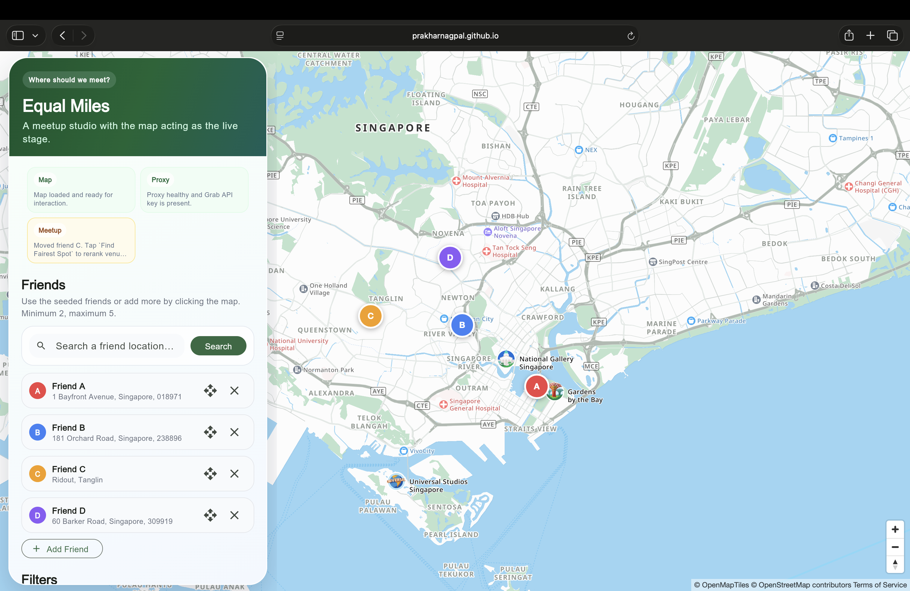
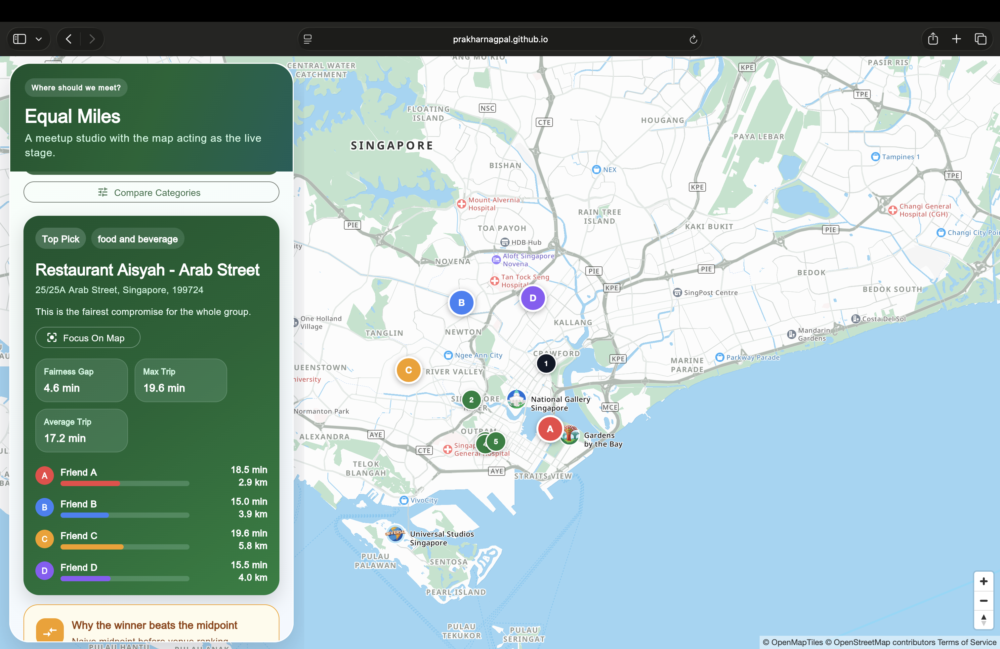

# ⚖️ Equal Miles

> **Stop arguing about where to meet. Start being fair about it.**

Equal Miles finds the meeting spot that nobody can complain about — because it's backed by real road travel times, not a finger-in-the-air midpoint.

**[→ Try the live demo](https://prakharnagpal.github.io/Grab_Maps_Hacakthon/)**

<br/>



<br/>

## The Problem With "Just Meet in the Middle"

Your friend group is scattered across the city. Someone suggests "let's just meet at the midpoint." Sounds fair — but roads aren't straight lines. That "midpoint" café ends up being a 5-minute walk for two people and a 40-minute drive for the third.

**Equal Miles fixes this.** It calls the Grab Directions API for every friend → every venue, measures the actual travel time spread, and ranks venues by who gets the fairest deal.

```
Fairness Gap = longest trip − shortest trip

The closer to zero, the fairer the meetup.
```

<br/>

## ✨ Features

| | Feature | What it does |
|---|---|---|
| ⚖️ | **Fairness Ranking** | Ranks venues by the gap between the fastest and slowest trip in your group — not by straight-line distance |
| 🏆 | **Fairest / Fastest / Closest badges** | Every result is labelled so you can understand the trade-off at a glance |
| 📍 | **Geographic Center Comparison** | Shows how many minutes fairer the winning venue is compared to the naive midpoint |
| 🎯 | **Compare Categories** | One click ranks Restaurant, Cafe, Bar, Hawker, and Mall — which vibe is fairest *right now* for your group? |
| 🗺️ | **Click-to-Place Friends** | Drop a friend pin anywhere on a live GrabMaps map with a single click |
| 🔍 | **Place Search** | Search friends' starting locations by address or landmark name |
| 🚗 | **5 Travel Modes** | Driving · Motorcycle · Tricycle · Cycling · Walking |
| ⭐ | **Recommended But Far** | When your radius is too tight, surfaces curated Singapore landmarks as stretch picks |
| 📡 | **Live Address Resolution** | Reverse-geocodes every dropped pin to show a real address automatically |

<br/>

## 🧮 How the Ranking Works

For each candidate venue, the app queries real travel directions from **every friend** simultaneously and computes a fairness score:

```
Score =  fairness gap           ← primary (who gets the worst deal?)
       + worst trip  × 0.22     ← secondary (how bad is the worst case?)
       + average trip × 0.08    ← tertiary (how far is everyone travelling overall?)
       + distance from group centroid × small weight  ← tie-breaker
```

The venue with the **lowest score wins.** The result also tells you how much better that venue is than if you had just met at the geographic midpoint.

<br/>



<br/>

## 🎯 What You See in the Results

- **Fairness Gap** — the difference in minutes between the friend with the longest trip and the shortest
- **Max Trip** — the worst-case commute anyone in the group faces
- **Average Trip** — how long everyone travels on average
- **Per-friend breakdown** — individual travel time and distance for each person, shown as a proportional progress bar
- **Why the winner beats the midpoint** — a side-by-side comparison proving the ranked venue is genuinely fairer than just splitting the difference

<br/>

## 🛣️ What's Coming Next

- [ ] Route lines drawn on the map per friend (already built — one flag to enable)
- [ ] Shareable result links so the whole group can see the same view
- [ ] Multiple ranking modes: Pure Fairness · Nobody Suffers · Fastest Total
- [ ] Traffic-aware routing for peak hours (Friday 7 PM, etc.)
- [ ] Ride cost fairness using Grab fare estimates
- [ ] Real-time multi-user mode — each friend places their own pin from their own phone

<br/>

## 🧰 Built With

`Flutter Web` · `Dart / Shelf` · `MapLibre GL JS` · `Grab Maps SDK` · `Docker` · `GitHub Actions`

<br/>

---

Built for the **Grab Maps Hackathon 2026** by [Prakhar Nagpal](https://github.com/PrakharNagpal)
